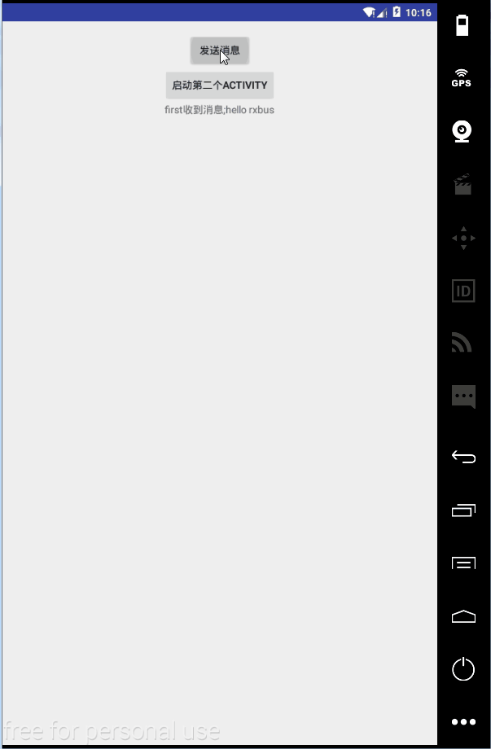

# RxBusDemo

1.前言
====

今天在网上突然看到说EventBus已经过时了，现在基本上没有人用了，都在有RxBus。看到这，吓了我一跳（心里万只草泥马狂奔，前一阵子才刚刚学完EventBus，现在竟然告诉lz过时了不用了！！！）但是作为一个有强烈求知欲的猿，我马上开始搜索了下RxBus并开始学习，于是有了这一篇文章。

2.简介
====

RxBus并不是一个库，而是一种模式(刚开始时以为有统一的标准，后来才发现不是绝对的，只是通过RxJava实现的一种模式)。它跟EventBus一样，都是作为事件总线间通信的桥梁。如果你的项目已经加入RxJava和EventBus，不妨用RxBus代替EventBus，以减少库的依赖。哦，原来并不是EventBus过时了，这个RxBus也是有一定限制的，只不过是2016年的RxJava太火了，才会出现上面的言论。

3.具体实现
======

1.添加依赖库
-------

```
 compile 'io.reactivex:rxjava:1.1.6'
 compile 'io.reactivex:rxandroid:1.2.1'
```

2.编写RxBus类
----------

```
public class RxBus {
    private final Subject<Object, Object> subject = new SerializedSubject<>(PublishSubject.create());
    private final Map<String, Object> tags = new HashMap<>();

    private static RxBus rxbus;

    public static RxBus getInstance()
    {
        if(rxbus == null)
        {
            synchronized (RxBus.class) {
                if(rxbus == null) {
                    rxbus = new RxBus();
                }
            }
        }
        return rxbus;
    }

    /**
     * 发送事件消息
     * @param tag 用于区分事件
     * @param object 事件的参数
     */
    public void post(String tag, Object object)
    {
        subject.onNext(object);
        if(!tags.containsKey(tag))
        {
            tags.put(tag, object);
        }
    }

    
    /**
     * 主线程中执行
     * @param tag
     * @param rxBusResult
     */
    public void toObserverableOnMainThread(final String tag, final RxBusResult rxBusResult) {

        subject.observeOn(AndroidSchedulers.mainThread()).subscribe(new Action1<Object>() {
            @Override
            public void call(Object o) {
                if (tags.containsKey(tag)) {
                    rxBusResult.onRxBusResult(o);
                }
            }
        });
    }

    /**
     * 子线程中执行
     * @param tag
     * @param rxBusResult
     */
    public void toObserverableChildThread(final String tag, final RxBusResult rxBusResult) {

        subject.observeOn(Schedulers.io()).subscribe(new Action1<Object>() {
            @Override
            public void call(Object o) {
                if (tags.containsKey(tag)) {
                    rxBusResult.onRxBusResult(o);
                }
            }
        });
    }

    /**
     * 移除tag
     * @param tag
     */
    public void removeObserverable(String tag)
    {
        if(tags.containsKey(tag))
        {
            tags.remove(tag);
        }
    }

    /**
     * 退出应用时，清空资源
     */
    public void release()
    {
        tags.clear();
        rxbus = null;
    }
}
```

3.使用实例
----

```
public class MainActivity extends Activity {

    @BindView(R.id.bt_sendmsg)
    Button bt_sendmsg;
    @BindView(R.id.bt_startactivity)
    Button btStartactivity;
    @BindView(R.id.tv_result)
    TextView tvResult;

    private RxBus rxBus = RxBus.getInstance();
    @Override
    protected void onCreate(Bundle savedInstanceState) {
        super.onCreate(savedInstanceState);
        setContentView(R.layout.activity_main);
        ButterKnife.bind(this);

        rxBus.toObserverableOnMainThread("first", new RxBusResult() {
            @Override
            public void onRxBusResult(Object o) {
                final String msg = (String)o;
                tvResult.setText("first收到消息;" + msg);
                Toast.makeText(MainActivity.this, "收到消息;" + msg, Toast.LENGTH_SHORT).show();
            }
        });

        rxBus.toObserverableOnMainThread("second", new RxBusResult() {
            @Override
            public void onRxBusResult(Object o) {
                String msg = (String)o;
                tvResult.setText("second收到消息;" + msg);
                Toast.makeText(MainActivity.this, "second收到消息;" + msg, Toast.LENGTH_SHORT).show();
            }
        });

    }
    ////发送消息
    @OnClick(R.id.bt_sendmsg)
    public void bt_sendmsg(View view){
        rxBus.post("first", new String("hello rxbus"));
    }

    //跳转界面
    @OnClick(R.id.bt_startactivity)
    public void bt_startActivity(View view){
        Intent intent = new Intent(MainActivity.this, SecondActivity.class);
        MainActivity.this.startActivity(intent);
    }

    /**
     * 退出时，释放rxbus
     */
    @Override
    protected void onDestroy() {
        super.onDestroy();
        rxBus.release();
    }


}
```

4.运行效果
------


5.总结
----

1、首先创建一个可同时充当Observer和Observable的Subject（单例模式，并且是SerializedSubject）；

2、在需要接收事件的地方，订阅该Subject（此时Subject是作为Observable），在这之后，一旦Subject接收到事件，立即发射给该订阅者；

3、在我们需要发送事件的地方，将事件post至Subject，此时Subject作为Observer接收到事件（onNext），然后会发射给所有订阅该Subject的订阅者。
